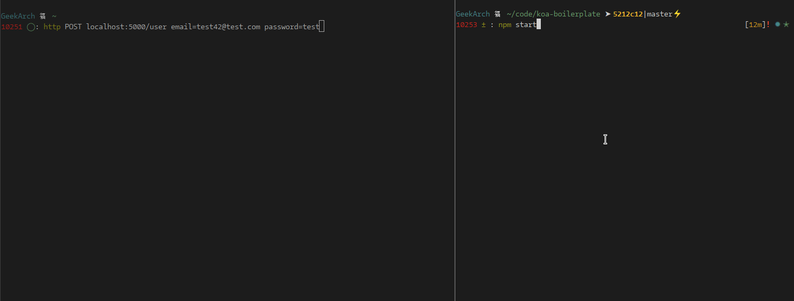
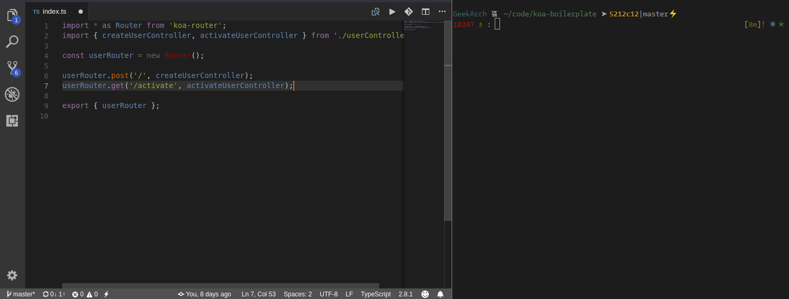

  

  An <em>opinionated</em> NodeJS API Boilerplate 
  focused on extensability and developer productivity.

  <a href="#whatsinside">What's inside?</a> •
  <a href="#requirements">Requirements</a> •
  <a href="#usage">Usage</a> •
  <a href="#an-awesome-developer-experience-just-for-you">Developer experience</a> •
  <a href="#customizing-it">Customizing it</a> •
  <a href="#troubleshooting">Troubleshooting</a> •
  <a href="#todo">TODO</a> •

  
  <!--  -->
  

 
 

This is a project based on NodeJS and Koa (and some other libs) implementing a REST API to authenticate users and let them manage TODOs stored in a SQL database. It's easy to extend and provides you the best developer experience possible with a lot of nifty things already configured.

It's meant to be used with a front-end consuming the API like a mobile app or a SPA built with for example [React](https://reactjs.org/), [Angular](https://angular.io/) or [Vue](https://vuejs.org/index.html).

## What's inside?

- [Koa](http://koajs.com/) with async/await code to handle asynchronous tasks
- [TypeScript](http://www.typescriptlang.org/) for awesome Developer Experience
- SQL integration with [Knex](http://knexjs.org/)
- Email/password account creation API routes
- Compatibility to add other OAuth providers as login methods and merge of multiple auth providers for a single account
- Account confirmation with a link sent by email
- Email sending with your SMTP server (and templating also included)
- Separated routers with [Koa-Router](https://github.com/alexmingoia/koa-router)
- Object injection in Koa context when references in the URL (like `/todo/12` injects the Todo object with id 12 in `ctx.todo`)
- Error middleware with custom error classes and asserts to handle basic errors like Not Found
- Routes testing with watch mode with [Jest](https://facebook.github.io/jest/)
- Code coverage
- [Eslint](https://eslint.org/) linting with pre-commit test and auto-fixing
- [Node-Config](https://github.com/lorenwest/node-config) for configuration and environment variable handling
- [Nodemon](https://github.com/remy/nodemon) to auto-reload your server when saving
- Tricky parts of code fully commented

## Requirements

- NodeJS (tested on v9.10.0): [Installation](https://nodejs.org/en/download/package-manager/)
- Git

## Usage

To start working on this project, you need to make a private copy of it:

- Clone it on your computer: `git clone https://github.com/geekuillaume/koa-boilerplate.git`
- If you are using Github, [create a repository](https://github.com/new) and set the origin in git with `git remote set-url origin https://github.com/YOUR_USERNAME/YOUR_REPO_NAME`
- Change the informations about the code in the [package.json](package.json) file
- Add and commit the changed `package.json`: `git add package.json` then `git commit`
- Push the repository content to your new repo with `git push origin master`

The server comes packed with some useful commands (defined in `package.json`):

- `npm run test`: Launch the Jest test suite
- `npm run test:watch`: Launch the Jest test suite in watch mode (the tests are executed after each file change)
- `npm run test:coverage`: Launch the Jest test suite and save coverage information in the `coverage` folder
- `npm run watch`: Start the project in watch mode, restarting it after each file change
- `npm run lint`: Analyze the project code with ESlint and show coding style errors (executed before each commit)
- `npm run doc:generate`: Generate the documentation in the `apiDoc` folder

## An awesome developer experience just for you

### Watch tests

### Email preview

### Pre-commit linting

## Customizing it

### Config

This project uses [node-config](https://github.com/lorenwest/node-config) to handle the different configuration options. I highly recommend you to read this module README to learn about the different ways to configure this project for different environments. The [config/local.js](config/local.js) file should be used for secrets in development.

### SQL

The SQL integration is made with [Knex](http://knexjs.org/). By default, only the sqlite adapter is installed but Knex allows you to use a lot of different SQL servers. You need to install the adapter for the server you're going to use, look at the documentation for more [information](http://knexjs.org/#Installation-node).

The sqlite adapter is primarly used as an in-memory portable database and shouldn't be used for production purposes. It's integrated by default because it's the simplest way to execute the tests as each Node process created by Jest will have it's own sqlite instance and each instance will be populated by the seed values before each test suite.

The SQL conf is located in each file of the [config](config) folder.

Migrations are handled by [Knex migration tool](http://knexjs.org/#Migrations). You can look at the default [todos migration file](migrations/20180327160540_todos.ts) for an example. Migrations are run before each test suite to initialize the sqlite database, and so the database is wiped clean, be careful to never use you production database when running the tests. To create a new migration, use the `npm run db:createMigration -- YOUR_MIGRATION_NAME` command. It will create a new file in the [migrations/](migrations) folder that you should use to define your migration steps. To run all non executed migrations, use the `npm run db:migrate` command.

### Email

This project includes a service to send emails to your users. It's used to send the activation link after the account creation and send the "Forgot password" link. In development mode, you can use the [Ethereal.email](https://ethereal.email) service to debug the emails your sending without really having to send them. I've included the instructions about how to create an account in the [config/development.js](config/development.js) file.

The email service uses the [Nodemailer](https://nodemailer.com/about/) module ans is compatible with all SMTP transactionnal email service providers. To get more informations about how you can configure it for you own usage, look at the [documentation](https://nodemailer.com/smtp/).

### Account activation

By default, every account created with an email/password combo is not active. It means that the user is in a read-only mode (you can change this behaviour according to your needs). To activate its account, the user should click the link in the email sent to his email address. This link points to the API that will redirect the user with a `302` to the URL specified in the `activateCallbackUrl` config variable. The auth token will be appended to this `activateCallbackUrl` as a `?auth_token=` query string. For example, if your `activateCallbackUrl` is `https://app.example.com/after_activation`, the user will be redirected to `https://app.example.com/after_activation?auth_token=AUTHENTICATION_TOKEN_FOR_THE_USER`. This token can then be used like a regular authentication token to access other API routes.

### UUID

Everywhere in this project, UUIDs are used instead of the classic auto-incremental integers IDs. This way you don't expose the number of elements in your db (like the number of users of your API). It can also help prevent bugs in your code as you cannot guess the id of a specific object and so cannot directly target it.

### Documentation

The `npm run doc:generate` command can be used to execute the script to generate the documentation in the `apiDoc` folder. Here's an example of the resulting documentation: [ApiDoc](https://rawgit.com/geekuillaume/nodejs-api-kickstarter/master/apiDoc/index.html).

You should look at the dedicated [README](misc/internals/docsComponents/README.md) for more information.

## Troubleshooting

### I need to reauth after restarting my server

This is because you didn't change the `jwtSecret` in you config file. Add a `jwtSecret` in your `config/local.js` file with a random string (at least 15 characters).

## TODO:

- [Sentry] integration (optional)
- Password reset via email
- Continous Integration (Docker, Kubernetes)
- Upload coverage and documentation to AWS S3
